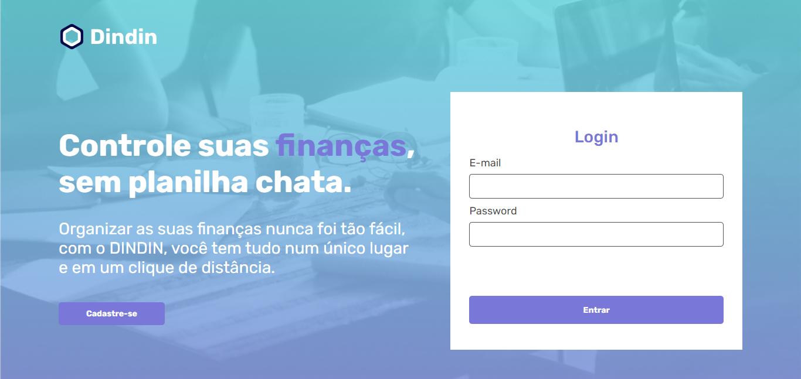
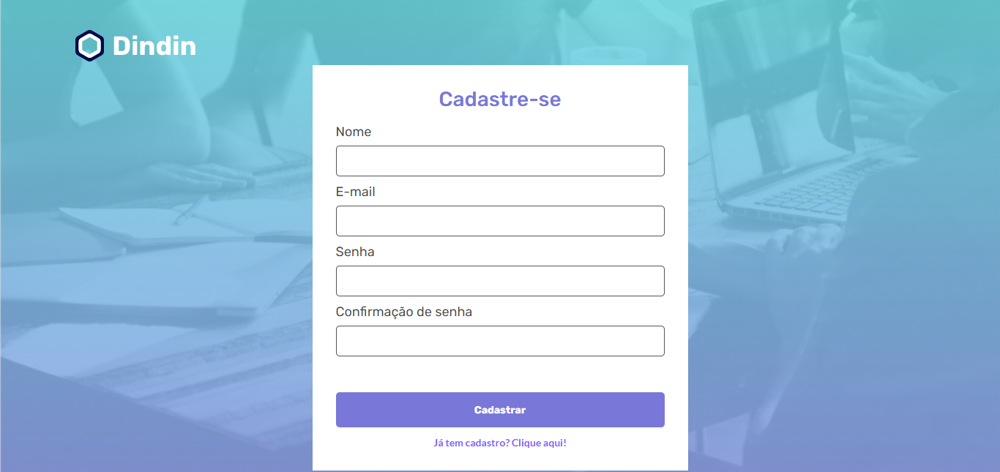
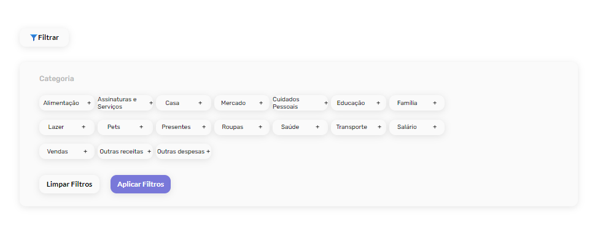
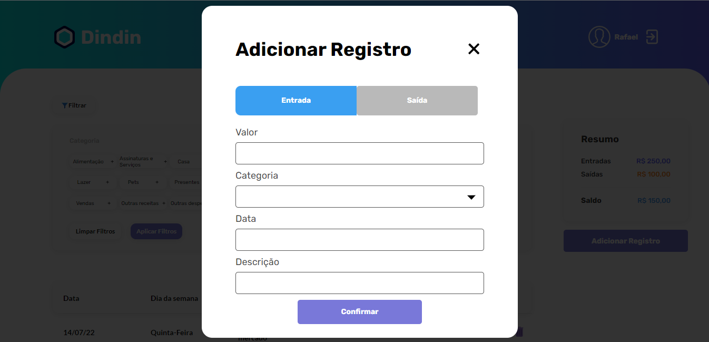
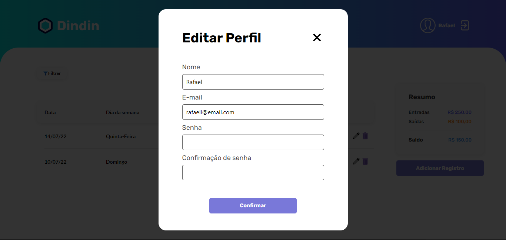

<h1>Dindin</h1>

O objetivo desse desafio era criar um site de controle e gestão de finanças pessoais.

<a href="https://github.com/diasrafael1/desafio03-apiDindin-CubosAcademy">Link da API</a> utilizada

<h2>Login</h2>
Tela de login que faz requisição com a API verificando se o usuário é cadastrado ou não.

<h2>Cadastro</h2>
Tela para cadastrar o usuário fazendo a requisição com a API e registrando no banco de dados.

<h2>Main</h2>
Tela principal, cujo somente o usuário logado tem acesso, nela é possível registrar todas as entradas e saídas do dinheiro, ver um resumo junto com o saldo atual, editar algum registro, deletar e opção para filtrar por categorias.

<h2>Editar Perfil</h2>
Na tela principal, também há uma funcionalidade de editar o seu perfil, podendo trocar nome e e-mail.

